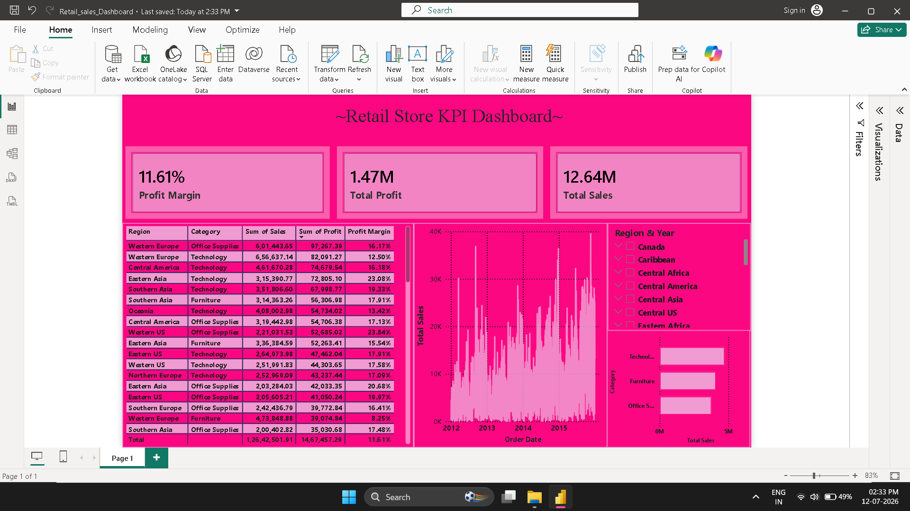

# 📊 Power BI Retail KPI Dashboard

An interactive **Retail KPI Dashboard** developed using **Microsoft Power BI** to analyze retail business performance through key metrics such as **Sales, Profit, and Profit Margin**. The dashboard provides interactive filtering and visual insights to support data-driven decision-making.

---

## 📌 Project Overview

This project demonstrates the use of Power BI for transforming raw retail data into an interactive business intelligence dashboard. Using DAX measures, KPI cards, slicers, and various visualizations, the dashboard enables users to monitor sales performance, profitability, and trends across different regions and product categories.

---

## 📂 Repository Structure

```
PowerBI-Retail-KPI-Dashboard
│
├── 📂 Dataset
│   └── global_superstore_2016.xlsx
│
├── 📄 README.md
├── 🖼️ Retail_sales_dashboard.png
└── 📊 Retail_sales_Dashboard.pbix
```

---

## 📊 Dashboard Features

- 📈 Total Sales KPI
- 💰 Total Profit KPI
- 📊 Profit Margin KPI
- 📉 Sales Trend Analysis
- 📦 Sales by Category
- 🌍 Region Filter
- 📅 Year Filter
- 🎯 Interactive Dashboard
- 🔴 Conditional Formatting for Negative Profit Values

---

## 🛠️ Tools & Technologies

- Microsoft Power BI Desktop
- Power Query
- DAX (Data Analysis Expressions)
- Data Modeling
- Interactive Data Visualization

---

## 📁 Dataset

**Dataset:** Global Superstore 2016

The dataset contains retail transaction records including:

- Order Date
- Region
- Category
- Sales
- Profit
- Quantity
- Discount
- Customer Information
- Product Information

---

## 📐 DAX Measures

```DAX
Total Sales =
SUM(Orders[Sales])

Total Profit =
SUM(Orders[Profit])

Profit Margin =
DIVIDE([Total Profit], [Total Sales], 0)
```

---

## 📷 Dashboard Preview

> Replace the image path if your screenshot filename changes.

<p align="center">
  
</p>

---

## 📈 Key Insights

- Analyze total sales and profitability across different regions.
- Compare category-wise sales performance.
- Track sales trends over time.
- Identify profitable and loss-making segments.
- Interactively filter the dashboard using Region and Year slicers.

---

## 🎯 Learning Outcomes

- Data Cleaning using Power Query
- Creating DAX Measures
- Building KPI Cards
- Implementing Interactive Filters
- Applying Conditional Formatting
- Designing Business Intelligence Dashboards

---

## 🚀 How to Use

1. Clone this repository.
2. Open `Retail_sales_Dashboard.pbix` in Microsoft Power BI Desktop.
3. If required, reconnect the dataset located inside the **Dataset** folder.
4. Refresh the data.
5. Explore the dashboard using the available slicers and visuals.

---

## 👨‍💻 Author

**Shagun Gupta**

B.Tech Computer Science & Engineering (AI & ML)

🔗 Passionate about **Data Analytics, Power BI, SQL, Python, and Business Intelligence.**

---

### ⭐ If you found this project useful, consider giving it a star!
